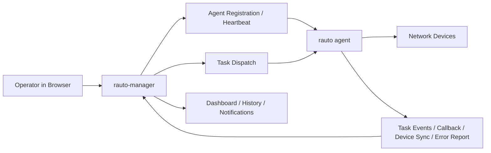

<div align="center">
  <h1>rauto-manager</h1>
  <p>Self-hosted control plane for <code>rauto</code> agent fleets.</p>
  <p>
    
    
    
    
    
  </p>
  <p>
    <a href="./README_zh.md">中文文档</a>
    ·
    <a href="https://github.com/demohiiiii/rauto">rauto</a>
    ·
    <a href="https://github.com/demohiiiii/rneter">rneter</a>
  </p>
</div>

`rauto-manager` brings agent onboarding, device inventory, task dispatch, workflow/orchestration design, live execution visibility, and admin operations into one web UI. It is designed for teams that want to manage multiple `rauto` agents from a central control plane instead of logging into each agent separately.

## Table of Contents

- [Overview](#overview)
- [Highlights](#highlights)
- [Architecture](#architecture)
- [Screenshots](#screenshots)
- [Quick Start](#quick-start)
- [Deploy to Vercel](#deploy-to-vercel)
- [Connect a `rauto` Agent](#connect-a-rauto-agent)
- [Dispatch Types](#dispatch-types)
- [Agent Compatibility](#agent-compatibility)
- [Tech Stack](#tech-stack)
- [Project Layout](#project-layout)
- [Related Projects](#related-projects)
- [License](#license)

## Overview

`rauto-manager` is the management layer for `rauto`.

- `rauto` focuses on execution: commands, templates, transaction blocks, workflows, orchestration, and agent runtime.
- `rauto-manager` focuses on control: multi-agent visibility, shared inventory, dispatch, live progress, history, and notifications.

This repository is best suited for self-hosted operator workflows where agents may run in different network zones and report back to a single manager over HTTP or gRPC.

## Highlights

- Multi-agent control plane with HTTP and gRPC agent support.
- Shared device inventory with manager-side add, sync, and reachability updates.
- Two task entry styles:
  - simple dialog for `exec`, `template`, and `tx_block`
  - visual designer for `tx_workflow` and `orchestrate`
- Live execution timeline, task events, notifications, and structured execution history.
- Transport-aware agent utilities for health check, connections, templates, device profiles, connection tests, and device sync.
- First-run admin bootstrap at `/setup`, JWT cookie auth, and English/Chinese localization.

## Architecture

### `rauto` vs `rauto-manager`

| Project | Role | Best for |
| --- | --- | --- |
| `rauto` | Execution engine and local operator tool | Running commands, templates, workflows, and web console operations on one workstation or one managed agent |
| `rauto-manager` | Central control plane | Managing multiple agents, shared inventory, centralized dispatch, and execution visibility |

### Control Flow



## Screenshots

The following screenshots reflect the current UI and the main operator flows in `rauto-manager`.

### Dashboard Overview

Operations summary for active agents, device reachability, daily task outcomes, and recent notifications.


### Agent Management

Agent status, transport mode, runtime metrics, and common manager-side actions.


### Agent Registration

Copy a ready-to-run `rauto agent` command for either HTTP or gRPC reporting mode.


### Device Onboarding

Select an agent, test connectivity, and save the device into the shared inventory through the agent transport.


### Task Dispatch

Dispatch simple day-to-day tasks directly from the task page.


### Workflow / Orchestration Designer

Build `tx_workflow` and `orchestrate` payloads visually on a canvas instead of editing raw JSON.


### Live Execution

Track task progress, event timeline updates, and status changes while the agent is still running.


### Task Results

Review callbacks, structured execution results, and centralized execution history.


## Quick Start

### 1. Install dependencies

```bash
npm install
```

### 2. Configure environment variables

```bash
cp .env.example .env
```

Required:

- `DATABASE_URL`: PostgreSQL connection string
- `JWT_SECRET`: signing secret for admin login
- `AGENT_API_KEY`: shared secret between manager and `rauto agent`

Optional:

- `NEXT_PUBLIC_AGENT_API_KEY`: prefill the registration dialog with the shared token
- `NEXT_PUBLIC_MANAGER_URL`: public base URL used in generated agent commands
- `NEXT_PUBLIC_MANAGER_GRPC_URL`: public gRPC address used in generated gRPC agent commands
- `AGENT_TIMEOUT`: stale agent timeout on the manager side
- `AGENT_HEARTBEAT_INTERVAL`: heartbeat hint shown in settings
- `MANAGER_GRPC_ENABLED`: set to `true` to enable the manager gRPC reporting server in self-hosted Node deployments
- `MANAGER_GRPC_HOST` / `MANAGER_GRPC_PORT`: manager gRPC bind host and port, default port `50051`
- `MANAGER_GRPC_MAX_MESSAGE_BYTES`: max gRPC message size, default `16777216` (16 MB)

### 3. Apply database migrations

```bash
npx prisma migrate deploy
```

For local schema iteration, `npx prisma migrate dev` also works.

### 4. Start the app

```bash
npm run dev
```

Open [http://localhost:3000](http://localhost:3000). On first boot, `/login` redirects to `/setup`, where you create the initial admin account.

> If you plan to use gRPC agents, run the manager in a self-hosted Node environment and set `MANAGER_GRPC_ENABLED=true`. The built-in manager gRPC listener is not started on Vercel.

## Deploy to Vercel

[](https://vercel.com/new/clone?repository-url=https://github.com/demohiiiii/rauto-manager&project-name=rauto-manager&repository-name=rauto-manager&env=JWT_SECRET,AGENT_API_KEY&envLink=https://github.com/demohiiiii/rauto-manager/blob/main/.env.example&products=%5B%7B%22type%22%3A%22integration%22%2C%22integrationSlug%22%3A%22neon%22%2C%22productSlug%22%3A%22neon%22%2C%22protocol%22%3A%22storage%22%7D%5D)

The Vercel flow creates a project and provisions a Neon Postgres database through the Neon integration.

Deployment notes:

1. Install or select the `Neon` integration during setup.
2. Let the integration inject `DATABASE_URL`, or provide the correct Neon connection string manually if you bind an existing database.
3. If Neon gives you a separate direct connection string, set `DIRECT_DATABASE_URL` for Prisma migrations.
4. Commit Prisma migration files under `prisma/migrations/`.
5. Use separate Neon databases or branches for Production and Preview.
6. Set `JWT_SECRET` and `AGENT_API_KEY` manually in Vercel.

This repository includes `vercel.json` and `npm run build:vercel`, which run `prisma migrate deploy` before `next build`.

If you see an error like `The table public.Admin does not exist`, it usually means:

- `prisma migrate deploy` did not run successfully during the build, or
- the runtime is pointing at a different Neon database or branch than the one migrations were applied to

## Connect a `rauto` Agent

Use managed agent mode from the `rauto` project. The agent token must match `AGENT_API_KEY` on the manager side.

### HTTP reporting mode

```bash
rauto agent \
  --bind 0.0.0.0 \
  --port 8123 \
  --manager-url http://<manager-host>:3000 \
  --report-mode http \
  --agent-name edge-sh-01 \
  --agent-token <same-agent-api-key>
```

### gRPC reporting mode

Use gRPC when the manager is self-hosted and reachable on its gRPC listener, for example `http://<manager-host>:50051`.

```bash
rauto agent \
  --bind 0.0.0.0 \
  --port 8123 \
  --manager-url http://<manager-host>:50051 \
  --report-mode grpc \
  --agent-name edge-sh-01 \
  --agent-token <same-agent-api-key>
```

Once connected, the manager can receive:

- registration and heartbeat updates
- offline notifications
- full device inventory sync
- incremental device reachability updates
- live task execution events
- task execution callbacks
- async agent-side error reports

For gRPC agents, manager-side control flows such as health check, connection list/save, template list, device profile discovery, connection test, device sync, and task dispatch also use gRPC instead of direct HTTP calls.

## Dispatch Types

| Type | Description |
| --- | --- |
| `exec` | Send a single command through a saved connection |
| `template` | Execute a named template with variables |
| `tx_block` | Run a transaction-style command block |
| `tx_workflow` | Execute a workflow payload handled by the agent |
| `orchestrate` | Submit a multi-step orchestration plan |

In the UI:

- The simple task dialog is used for `exec`, `template`, and `tx_block`
- The `Workflow / Orchestration` designer is used for `tx_workflow` and `orchestrate`

## Agent Compatibility

For the full UI workflow, use a recent `rauto agent`.

### HTTP mode

The agent should expose:

- `GET /api/connections`
- `PUT /api/connections/{name}`
- `POST /api/connection/test`
- `GET /api/templates`
- `GET /api/device-profiles/all`
- `GET /api/device-profiles/{name}/modes`
- `POST /api/devices/probe`

### gRPC mode

The agent should implement the matching RPCs in `AgentTaskService` / `AgentReportingService`, including:

- task dispatch
- task event reporting
- task callback reporting
- connection list / save
- connection test
- template list
- device profile list
- profile modes lookup
- device probing / sync

`rauto-manager` automatically chooses HTTP or gRPC based on the saved agent report mode.

## Tech Stack

- Next.js 16 + React 19 + Tailwind CSS 4
- Prisma 7 + PostgreSQL
- TanStack Query + Zustand
- `next-intl` for English/Chinese localization

## Project Layout

```text
rauto-manager/
├── app/                 # UI pages and API routes
├── components/          # dashboards, dialogs, task forms, shared UI
├── lib/                 # auth, Prisma, dispatch, state, utilities
├── messages/            # en.json / zh.json
├── prisma/              # schema and migrations
└── README.md            # English documentation
```

## Related Projects

- [rauto](https://github.com/demohiiiii/rauto): Rust-based network automation CLI, web console, and managed agent runtime
- [rneter](https://github.com/demohiiiii/rneter): SSH connection and device interaction library used by `rauto`

## License

GNU Affero General Public License v3.0 (`AGPL-3.0-only`).

If you modify this project and offer it as a network service, you must make the corresponding source code available under the same license.
