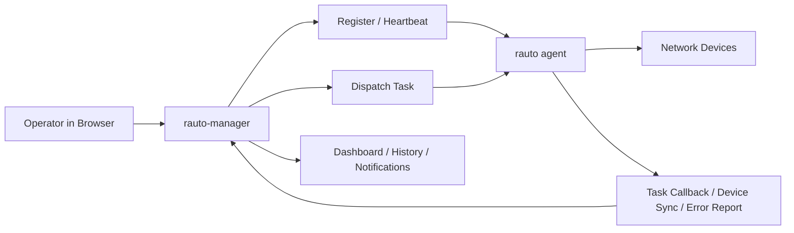

# rauto-manager - Multi-Agent Control Plane for `rauto`


[中文文档](README_zh.md)

`rauto-manager` is a self-hosted control plane for `rauto` agent fleets. It centralizes agent onboarding, shared device inventory, task dispatch, workflow/orchestration design, live execution tracking, notifications, and administrator access in one web UI.

- Manage agents over HTTP or gRPC from one control plane.
- Use a simple task dialog for `exec`, `template`, and `tx_block`, plus a visual designer for `tx_workflow` and `orchestrate`.
- Follow live task events, structured execution history, and notifications without logging into each agent separately.

## Deploy

[](https://vercel.com/new/clone?repository-url=https://github.com/demohiiiii/rauto-manager&project-name=rauto-manager&repository-name=rauto-manager&env=JWT_SECRET,AGENT_API_KEY&envLink=https://github.com/demohiiiii/rauto-manager/blob/main/.env.example&products=%5B%7B%22type%22%3A%22integration%22%2C%22integrationSlug%22%3A%22neon%22%2C%22productSlug%22%3A%22neon%22%2C%22protocol%22%3A%22storage%22%7D%5D)

The deploy flow creates a Vercel project and provisions a Neon Postgres database through the Neon integration.

Neon setup requirements:

- Install or select the `Neon` integration during the Vercel setup flow.
- Let the integration inject `DATABASE_URL`; you do not need to enter it manually when creating a new Neon database from the deploy flow.
- If you link an existing Neon database, set `DATABASE_URL` to the Neon Postgres connection string for that database.
- If Neon provides a separate direct connection string, set `DIRECT_DATABASE_URL` to that direct URL for Prisma migrations.
- Keep Prisma migrations committed under `prisma/migrations/` so `prisma migrate deploy` has something to apply.
- Use separate Neon databases or branches for Production and Preview instead of pointing both environments at the same database.
- You still need to enter `JWT_SECRET` and `AGENT_API_KEY` manually in the Vercel form.

## `rauto` vs `rauto-manager`

| Project | Role | Best for |
| --- | --- | --- |
| `rauto` | Execution engine and local operator tool | Running commands, templates, workflows, and web console operations on one workstation or one managed agent |
| `rauto-manager` | Central control plane | Managing multiple agents, shared device inventory, centralized task dispatch, and execution visibility |

## Features

- Centralized agent lifecycle management over HTTP or gRPC: registration, heartbeat updates, offline reporting, runtime metrics, health checks, and agent-side error reports.
- Shared device inventory: add devices from the UI, sync inventory from agents, and track reachability updates over time.
- Two task entry styles: a simple task dialog for `exec`, `template`, and `tx_block`, plus a visual workflow/orchestration designer for `tx_workflow` and `orchestrate`.
- Agent-aware operator helpers: list/save connections, test connectivity, load templates, discover device profiles, and sync devices through the connected agent transport.
- Live execution visibility: dashboard, notifications, task events, progress updates, execution history, and structured result rendering for transaction/workflow/orchestration tasks.
- Built-in docs center: quick links to the `rauto-manager`, `rauto`, and `rneter` repositories from inside the UI.
- Built-in admin bootstrap: first-run setup at `/setup`, JWT cookie auth, and localized UI messages in English and Chinese.

## Product Tour

### 1. Dashboard

Get an operations-first summary of active agents, device reachability, daily task outcomes, recent notifications, and the current health score of the control plane.

### 2. Agent Registration

Open the registration dialog, copy a ready-to-run `rauto agent` command, and bring a new agent online with heartbeat reporting and runtime metrics.

### 3. Device Onboarding

Select an online agent, discover supported device profiles from that agent, test the connection, then save the device into both the agent's connection store and the manager inventory.

### 4. Task Dispatch

Use the simple task dialog for day-to-day work such as `exec`, `template`, and `tx_block`, with saved connection reuse and transport-aware agent selection.

### 5. Workflow / Orchestration Designer

Open the visual designer to build `tx_workflow` and `orchestrate` payloads on a canvas instead of writing raw JSON by hand.

### 6. History and Notifications

Follow task callbacks, execution results, live task events, device sync activity, and agent-side error reports from one place instead of chasing logs across multiple hosts.

## Demo Flow



## Screenshots

The screenshots below reflect the current UI and the main operator flows in `rauto-manager`.

### Dashboard Overview

Operations summary for active agents, device reachability, daily task outcomes, and recent notifications.


### Agent Registration

Copy a ready-to-run `rauto agent` command and bring a new agent online with the correct manager address and shared token.


### Device Onboarding

Select an agent, test the connection, and save the device into the manager inventory through the agent transport.


### Task Dispatch

Dispatch simple tasks directly from the main task page. Transaction workflows and orchestration flows are available through the visual `Workflow / Orchestration` designer.


### Task Results

Review callbacks, structured execution results, and history from one place instead of checking multiple hosts manually.


## Stack

- Next.js 16 + React 19 + Tailwind CSS 4
- Prisma 7 + PostgreSQL
- TanStack Query + Zustand
- `next-intl` for English/Chinese localization

## Quick Start

### 1. Install dependencies

```bash
npm install
```

### 2. Configure environment variables

```bash
cp .env.example .env
```

Required settings:

- `DATABASE_URL`: PostgreSQL connection string.
- `JWT_SECRET`: signing secret for admin login.
- `AGENT_API_KEY`: shared secret used between the manager and `rauto agent`.

Optional but useful:

- `NEXT_PUBLIC_AGENT_API_KEY`: if set, the UI can prefill the agent registration command with the same token.
- `NEXT_PUBLIC_MANAGER_URL`: if set, the UI uses this public base URL when generating the `rauto agent` command.
- `AGENT_TIMEOUT`: manager-side timeout for stale agents.
- `AGENT_HEARTBEAT_INTERVAL`: manager-side heartbeat interval hint shown in settings.
- `MANAGER_GRPC_ENABLED`: set to `true` to start the manager gRPC reporting server in self-hosted Node deployments.
- `MANAGER_GRPC_HOST` / `MANAGER_GRPC_PORT`: bind host and port for the manager gRPC reporting server. Default port is `50051`.
- `MANAGER_GRPC_MAX_MESSAGE_BYTES`: max gRPC message size for task events and callbacks. Default is `16777216` (16 MB).

### 3. Apply database migrations

```bash
npx prisma migrate deploy
```

For local schema iteration, `npx prisma migrate dev` also works.

Important:

- Commit generated files under `prisma/migrations/` before deploying so Vercel can apply them with `prisma migrate deploy`.
- On Vercel, prefer running migrations during the deployment build instead of trying to migrate on application startup. This repository includes `vercel.json` and `npm run build:vercel`, which execute `prisma migrate deploy` before `next build`.

### 4. Start the app

```bash
npm run dev
```

Open [http://localhost:3000](http://localhost:3000). On first boot, `/login` redirects to `/setup`, where you create the initial admin account.

If you plan to use gRPC agents, run the manager in a self-hosted Node environment and set `MANAGER_GRPC_ENABLED=true`. The built-in gRPC listener is disabled on Vercel.

## Deploying To Vercel

1. If you change the Prisma schema locally, generate and commit a new migration:

```bash
npx prisma migrate dev --name init
```

2. In the Vercel project, install or select the `Neon` integration so it can provide `DATABASE_URL`, then set `JWT_SECRET` and `AGENT_API_KEY`.

3. Use a dedicated Neon database or branch for each environment. Do not point Preview and Production at the same database.

4. Deploy normally. Vercel will run `npm run build:vercel`, which applies committed migrations with `prisma migrate deploy` before building the Next.js app.

If you see an error like `The table public.Admin does not exist`, it usually means either:

- `prisma migrate deploy` did not run successfully during the build, or
- Vercel runtime is pointing at a different Neon database or branch than the one migrations were applied to.

Do not place migrations inside request handlers or Prisma client initialization. On Vercel, there is no single long-lived app startup lifecycle you can safely rely on for one-time schema changes.

## Connect a `rauto` Agent

Use managed agent mode from the `rauto` project. The agent token must match `AGENT_API_KEY` on the manager side.

### HTTP reporting mode

```bash
rauto agent \
  --bind 0.0.0.0 \
  --port 8123 \
  --manager-url http://<manager-host>:3000 \
  --report-mode http \
  --agent-name edge-sh-01 \
  --agent-token <same-agent-api-key>
```

### gRPC reporting mode

Use gRPC when the manager is self-hosted and reachable on its gRPC listener, for example `http://<manager-host>:50051`.

```bash
rauto agent \
  --bind 0.0.0.0 \
  --port 8123 \
  --manager-url http://<manager-host>:50051 \
  --report-mode grpc \
  --agent-name edge-sh-01 \
  --agent-token <same-agent-api-key>
```

Once connected, the manager can receive:

- registration and heartbeat updates
- offline notifications
- full device inventory sync
- incremental device reachability updates
- live task execution events
- task execution callbacks
- async agent-side error reports

For gRPC agents, manager-side control flows such as health check, connection list/save, template list, device profile discovery, connection test, device sync, and task dispatch also use gRPC instead of direct HTTP calls.

## Dispatch Types

| Type | Description |
| --- | --- |
| `exec` | Send a single command through a saved connection. |
| `template` | Execute a named template with variables. |
| `tx_block` | Run a transaction-style command block. |
| `tx_workflow` | Execute a workflow payload handled by the agent. |
| `orchestrate` | Submit a multi-step orchestration plan. |

In the UI:

- The simple task dialog is used for `exec`, `template`, and `tx_block`.
- The `Workflow / Orchestration` designer is used for `tx_workflow` and `orchestrate`.

## Agent Compatibility

For the full UI workflow, connect a recent `rauto agent`.

In HTTP mode, the agent should expose these APIs:

- `GET /api/connections`
- `PUT /api/connections/{name}`
- `POST /api/connection/test`
- `GET /api/templates`
- `GET /api/device-profiles/all`
- `POST /api/devices/probe`

In gRPC mode, the agent should implement the equivalent RPCs in `AgentTaskService` / `AgentReportingService`, including:

- task dispatch
- task event reporting
- task callback reporting
- connection list/save
- connection test
- template list
- device profile list
- device probing / sync

`rauto-manager` will automatically choose HTTP or gRPC based on the agent report mode saved on the manager side.

## Project Layout

```text
rauto-manager/
├── app/                 # UI pages and API routes
├── components/          # dashboard, dialogs, task forms, shared UI
├── lib/                 # auth, Prisma, dispatch, stores, utilities
├── messages/            # en.json / zh.json
├── prisma/              # schema and migrations
└── README_zh.md         # Chinese documentation
```

## Related Projects

- [rauto](https://github.com/demohiiiii/rauto): Rust-based network automation CLI, web console, and managed agent runtime.
- [rneter](https://github.com/demohiiiii/rneter): SSH connection and device interaction library used by `rauto`.

## License

GNU Affero General Public License v3.0 (`AGPL-3.0-only`).

If you modify this project and offer it as a network service, you must make the corresponding source code available under the same license.
