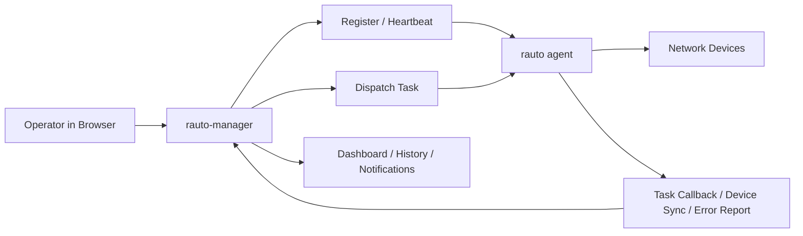
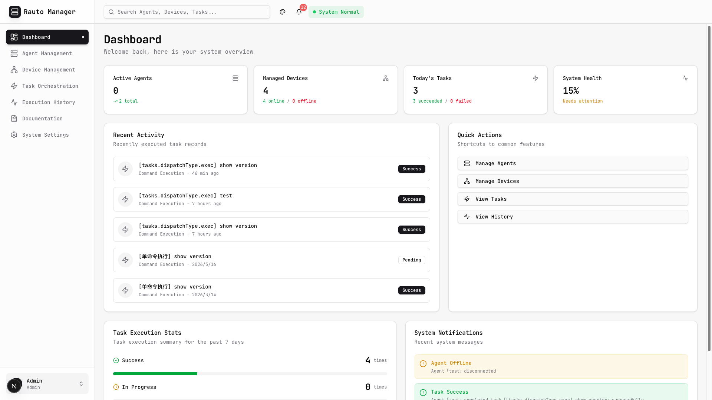
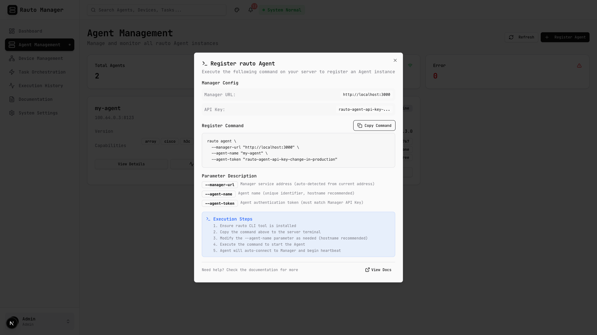
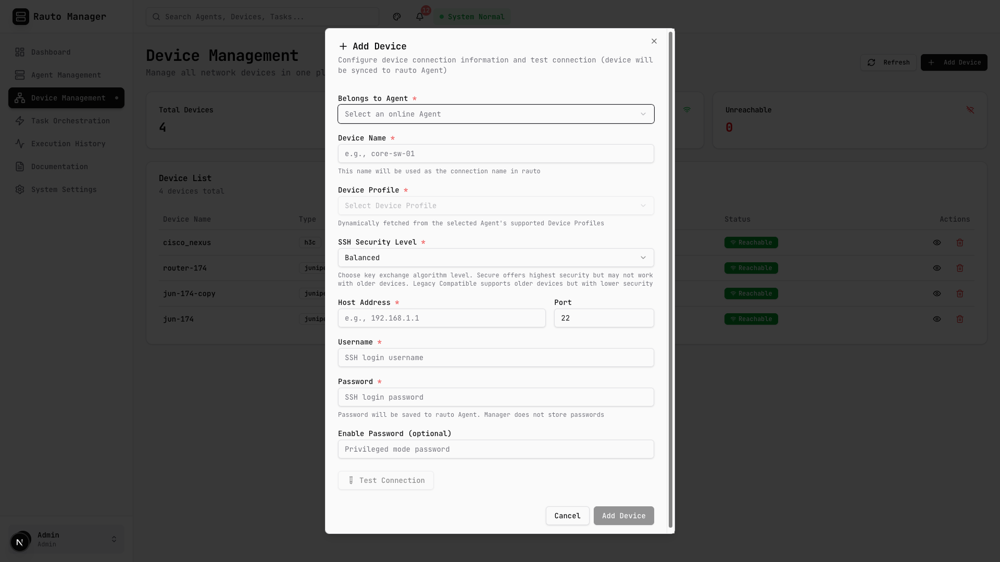
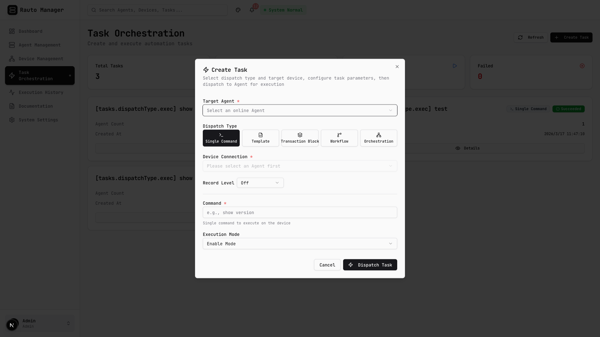
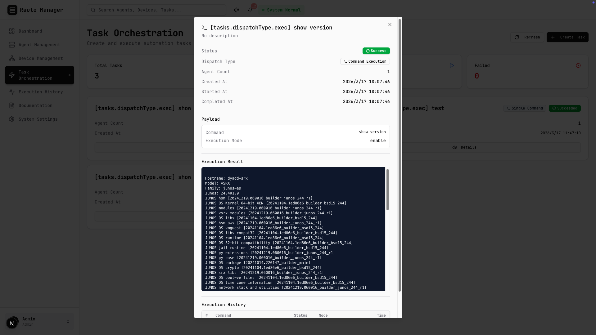

# rauto-manager - Multi-Agent Control Plane for `rauto`


[](https://vercel.com/new/clone?repository-url=https://github.com/demohiiiii/rauto-manager&project-name=rauto-manager&repository-name=rauto-manager&env=DATABASE_URL,JWT_SECRET,AGENT_API_KEY,NEXT_PUBLIC_API_URL,NEXT_PUBLIC_AGENT_API_KEY,AGENT_TIMEOUT,AGENT_HEARTBEAT_INTERVAL)
[中文文档](README_zh.md)

`rauto-manager` is a self-hosted control plane for fleets of `rauto` agents. It adds a central web UI for agent registration, device inventory, task dispatch, execution history, notifications, and administrator access.

> Current implementation already includes admin setup/login, PostgreSQL persistence, agent heartbeat and offline handling, device sync, task callbacks, SSE notifications, runtime metrics, and English/Chinese UI support.

## `rauto` vs `rauto-manager`

| Project | Role | Best for |
| --- | --- | --- |
| `rauto` | Execution engine and local operator tool | Running commands, templates, workflows, and web console operations on one workstation or one managed agent |
| `rauto-manager` | Central control plane | Managing multiple agents, shared device inventory, centralized task dispatch, and execution visibility |

## Features

- Centralized agent lifecycle management: registration, heartbeat updates, offline reporting, runtime metrics, and agent-side error reports.
- Shared device inventory: add devices from the UI, sync inventory from agents, and track reachability updates over time.
- Agent-aware task dispatch: supports `exec`, `template`, `tx_block`, `tx_workflow`, and `orchestrate`.
- Operator workflow helpers: proxy connection list, template list, and device profile discovery from connected agents.
- Safer onboarding flow: test a device connection before saving it into the agent and manager inventory.
- Operations visibility: dashboard, notifications, recent activity, execution history, and live updates over Server-Sent Events.
- Built-in admin bootstrap: first-run setup at `/setup`, JWT cookie auth, and localized UI messages in English and Chinese.

## Product Tour

### 1. Dashboard

Get an operations-first summary of active agents, device reachability, daily task outcomes, recent notifications, and the current health score of the control plane.

### 2. Agent Registration

Open the registration dialog, copy a ready-to-run `rauto agent` command, and bring a new agent online with heartbeat reporting and runtime metrics.

### 3. Device Onboarding

Select an online agent, discover supported device profiles from that agent, test the connection, then save the device into both the agent's connection store and the manager inventory.

### 4. Task Dispatch

Pick an online agent, reuse a saved connection, and dispatch one of five execution types: `exec`, `template`, `tx_block`, `tx_workflow`, or `orchestrate`.

### 5. History and Notifications

Follow task callbacks, execution results, device sync activity, and agent-side error reports from one place instead of chasing logs across multiple hosts.

## Demo Flow



## Screenshots

Add your project screenshots under `docs/screenshots/` with the filenames below and GitHub will render them directly on the repository homepage.

### Dashboard Overview



### Agent Registration



### Device Onboarding



### Task Dispatch



### Task Results



## Stack

- Next.js 16 + React 19 + Tailwind CSS 4
- Prisma 7 + PostgreSQL
- TanStack Query + Zustand
- `next-intl` for English/Chinese localization

## Quick Start

### 1. Install dependencies

```bash
npm install
```

### 2. Configure environment variables

```bash
cp .env.example .env
```

Required settings:

- `DATABASE_URL`: PostgreSQL connection string.
- `JWT_SECRET`: signing secret for admin login.
- `AGENT_API_KEY`: shared secret used between the manager and `rauto agent`.

Optional but useful:

- `NEXT_PUBLIC_API_URL`: defaults to `http://localhost:3000/api`.
- `NEXT_PUBLIC_AGENT_API_KEY`: if set, the UI can prefill the agent registration command with the same token.
- `AGENT_TIMEOUT`: manager-side timeout for stale agents.
- `AGENT_HEARTBEAT_INTERVAL`: manager-side heartbeat interval hint shown in settings.

### 3. Apply database migrations

```bash
npx prisma migrate deploy
```

For local schema iteration, `npx prisma migrate dev` also works.

Important:

- Commit generated files under `prisma/migrations/` before deploying so Vercel can apply them with `prisma migrate deploy`.
- On Vercel, prefer running migrations during the deployment build instead of trying to migrate on application startup. This repository includes `vercel.json` and `npm run build:vercel`, which execute `prisma migrate deploy` before `next build`.

### 4. Start the app

```bash
npm run dev
```

Open [http://localhost:3000](http://localhost:3000). On first boot, `/login` redirects to `/setup`, where you create the initial admin account.

## Deploying To Vercel

1. If you change the Prisma schema locally, generate and commit a new migration:

```bash
npx prisma migrate dev --name init
```

2. Set `DATABASE_URL`, `JWT_SECRET`, and `AGENT_API_KEY` in the Vercel project environment variables.

3. Deploy normally. Vercel will run `npm run build:vercel`, which applies committed migrations with `prisma migrate deploy` before building the Next.js app.

Do not place migrations inside request handlers or Prisma client initialization. On Vercel, there is no single long-lived app startup lifecycle you can safely rely on for one-time schema changes.

## Connect a `rauto` Agent

Use managed agent mode from the `rauto` project. The agent token must match `AGENT_API_KEY` on the manager side.

```bash
rauto agent \
  --bind 0.0.0.0 \
  --port 8123 \
  --manager-url http://<manager-host>:3000 \
  --agent-name edge-sh-01 \
  --agent-token <same-agent-api-key>
```

Once connected, the manager can receive:

- registration and heartbeat updates
- offline notifications
- full device inventory sync
- incremental device reachability updates
- task execution callbacks
- async agent-side error reports

## Dispatch Types

| Type | Description |
| --- | --- |
| `exec` | Send a single command through a saved connection. |
| `template` | Execute a named template with variables. |
| `tx_block` | Run a transaction-style command block. |
| `tx_workflow` | Execute a workflow payload handled by the agent. |
| `orchestrate` | Submit a multi-step orchestration plan. |

## Agent Compatibility

For the full UI workflow, connect a recent `rauto agent` that exposes these APIs:

- `GET /api/connections`
- `PUT /api/connections/{name}`
- `POST /api/connection/test`
- `GET /api/templates`
- `GET /api/device-profiles/all`
- `POST /api/devices/probe`

`rauto-manager` already proxies these endpoints to power connection selection, device profile discovery, template selection, connection testing, and device sync from the web UI.

## Project Layout

```text
rauto-manager/
├── app/                 # UI pages and API routes
├── components/          # dashboard, dialogs, task forms, shared UI
├── lib/                 # auth, Prisma, dispatch, stores, utilities
├── messages/            # en.json / zh.json
├── prisma/              # schema and migrations
└── README_zh.md         # Chinese documentation
```

## Related Projects

- [rauto](https://github.com/demohiiiii/rauto): Rust-based network automation CLI, web console, and managed agent runtime.
- [rneter](https://github.com/demohiiiii/rneter): SSH connection and device interaction library used by `rauto`.

## License

GNU Affero General Public License v3.0 (`AGPL-3.0-only`).

If you modify this project and offer it as a network service, you must make the corresponding source code available under the same license.
