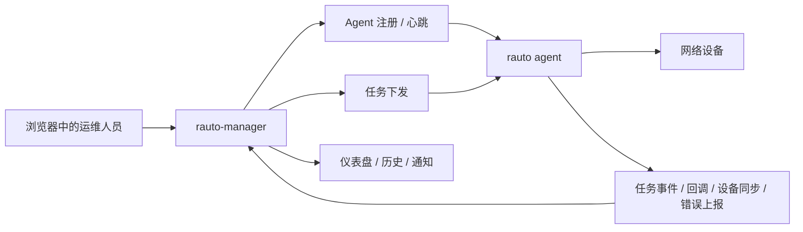

<div align="center">
  <h1>rauto-manager</h1>
  <p>面向 <code>rauto</code> Agent 集群的自托管控制平面。</p>
  <p>
    
    
    
    
    
  </p>
  <p>
    <a href="./README.md">English Documentation</a>
    ·
    <a href="https://github.com/demohiiiii/rauto">rauto</a>
    ·
    <a href="https://github.com/demohiiiii/rneter">rneter</a>
  </p>
</div>

`rauto-manager` 把 Agent 接入、设备清单、任务下发、工作流/编排设计、实时执行过程、执行历史和管理入口统一到一个 Web 控制台里。它适合希望集中管理多台 `rauto` Agent，而不是逐台登录处理的运维场景。

## 目录

- [项目简介](#项目简介)
- [核心能力](#核心能力)
- [架构说明](#架构说明)
- [截图展示](#截图展示)
- [快速开始](#快速开始)
- [部署到 Vercel](#部署到-vercel)
- [接入 `rauto` Agent](#接入-rauto-agent)
- [下发类型](#下发类型)
- [Agent 兼容性](#agent-兼容性)
- [技术栈](#技术栈)
- [项目结构](#项目结构)
- [相关项目](#相关项目)
- [许可证](#许可证)

## 项目简介

`rauto-manager` 是 `rauto` 的管理层。

- `rauto` 负责执行：命令、模板、事务块、工作流、编排和 Agent 运行时
- `rauto-manager` 负责控制：多 Agent 视图、共享设备清单、集中下发、实时状态、历史与通知

如果你的 Agent 分散在不同网络区域，希望通过一个中心化控制平面统一管理 HTTP 或 gRPC 接入的 Agent，这个项目就是为这种场景准备的。

## 核心能力

- 支持 HTTP 和 gRPC 两种 Agent 接入模式。
- 提供共享设备清单，可在 Manager 中添加、同步和查看设备可达状态。
- 提供两种任务入口：
  - 普通任务弹窗：`exec`、`template`、`tx_block`
  - 可视化设计器：`tx_workflow`、`orchestrate`
- 支持实时执行事件、进度时间线、通知和结构化执行历史。
- Agent 相关控制能力会按接入方式自动选择 HTTP 或 gRPC。
- 支持首次管理员初始化、中英文界面和基于 JWT Cookie 的登录态。

## 架构说明

### `rauto` 与 `rauto-manager` 的分工

| 项目 | 角色 | 适用场景 |
| --- | --- | --- |
| `rauto` | 执行引擎和本地操作工具 | 在单台工作站或单个 Agent 上执行命令、模板、工作流和本地 Web 控制台操作 |
| `rauto-manager` | 中心化控制平面 | 管理多 Agent、共享设备清单、统一下发任务、集中查看执行状态 |

### 控制流



## 截图展示

下面这些截图展示的是当前 `rauto-manager` 的主要界面和典型操作路径。

### 仪表盘总览

集中查看在线 Agent、设备可达性、当天任务结果和最近通知。


### Agent 管理

展示 Agent 状态、连接方式、运行时指标和常用操作入口。


### Agent 注册

直接复制 HTTP 或 gRPC 模式的 `rauto agent` 启动命令。


### 设备接入

选择 Agent、测试连接，并通过 Agent 通道把设备写入共享设备清单。


### 任务下发

适合日常任务的快速下发入口。


### 工作流 / 编排设计器

通过画布构建 `tx_workflow` 和 `orchestrate`，而不是手写原始 JSON。


### 实时执行过程

在任务执行过程中查看进度、事件时间线和状态变化。


### 任务结果

集中查看任务回调、结构化执行结果和执行历史。


## 快速开始

### 1. 安装依赖

```bash
npm install
```

### 2. 配置环境变量

```bash
cp .env.example .env
```

必填项：

- `DATABASE_URL`：PostgreSQL 连接串
- `JWT_SECRET`：管理员登录使用的 JWT 签名密钥
- `AGENT_API_KEY`：Manager 与 `rauto agent` 之间共享的认证密钥

可选项：

- `NEXT_PUBLIC_AGENT_API_KEY`：让注册弹窗自动预填 Agent token
- `NEXT_PUBLIC_MANAGER_URL`：生成 Agent 注册命令时使用的公开地址
- `NEXT_PUBLIC_MANAGER_GRPC_URL`：生成 gRPC Agent 注册命令时使用的公开 gRPC 地址
- `AGENT_TIMEOUT`：Manager 侧 Agent 失活超时时间
- `AGENT_HEARTBEAT_INTERVAL`：设置页中的心跳间隔提示
- `MANAGER_GRPC_ENABLED`：在自托管 Node 环境中设为 `true` 以启用 Manager gRPC 服务
- `MANAGER_GRPC_HOST` / `MANAGER_GRPC_PORT`：Manager gRPC 服务监听地址和端口，默认 `50051`
- `MANAGER_GRPC_MAX_MESSAGE_BYTES`：gRPC 最大消息大小，默认 `16777216`（16 MB）

### 3. 执行数据库迁移

```bash
npx prisma migrate deploy
```

如果你在本地迭代 schema，也可以使用 `npx prisma migrate dev`。

### 4. 启动应用

```bash
npm run dev
```

访问 [http://localhost:3000](http://localhost:3000)。首次启动时，`/login` 会自动跳转到 `/setup`，用于创建第一个管理员账号。

> 如果你计划接入 gRPC Agent，请使用自托管 Node 环境部署 Manager，并设置 `MANAGER_GRPC_ENABLED=true`。Vercel 上不会启动内置的 Manager gRPC 监听服务。

## 部署到 Vercel

[](https://vercel.com/new/clone?repository-url=https://github.com/demohiiiii/rauto-manager&project-name=rauto-manager&repository-name=rauto-manager&env=JWT_SECRET,AGENT_API_KEY&envLink=https://github.com/demohiiiii/rauto-manager/blob/main/.env.example&products=%5B%7B%22type%22%3A%22integration%22%2C%22integrationSlug%22%3A%22neon%22%2C%22productSlug%22%3A%22neon%22%2C%22protocol%22%3A%22storage%22%7D%5D)

这个入口会在 Vercel 创建项目，并通过 Neon integration 绑定 Neon Postgres 数据库。

部署时建议确认：

1. 在 Vercel 创建项目时安装或选择 `Neon` integration。
2. 让集成自动注入 `DATABASE_URL`，或者手动填入正确的 Neon 连接串。
3. 如果 Neon 提供了直连串，把它配置到 `DIRECT_DATABASE_URL`，供 Prisma 迁移使用。
4. 将 `prisma/migrations/` 提交到仓库。
5. Production 和 Preview 使用不同的 Neon 数据库或 branch。
6. 在 Vercel 中手动设置 `JWT_SECRET` 和 `AGENT_API_KEY`。

仓库已经包含 `vercel.json` 和 `npm run build:vercel`，会在构建前执行 `prisma migrate deploy`。

如果部署时看到 `The table public.Admin does not exist`，通常意味着：

- `prisma migrate deploy` 没有在构建阶段成功执行，或
- 当前运行环境指向了另一个没有完成迁移的数据库 / branch

## 接入 `rauto` Agent

使用 `rauto` 的托管 Agent 模式启动。`--agent-token` 必须与 Manager 侧的 `AGENT_API_KEY` 保持一致。

### HTTP 上报模式

```bash
rauto agent \
  --bind 0.0.0.0 \
  --port 8123 \
  --manager-url http://<manager-host>:3000 \
  --report-mode http \
  --agent-name edge-sh-01 \
  --agent-token <same-agent-api-key>
```

### gRPC 上报模式

如果使用 gRPC，请把 `--manager-url` 指向 Manager 的 gRPC 监听地址，例如 `http://<manager-host>:50051`。

```bash
rauto agent \
  --bind 0.0.0.0 \
  --port 8123 \
  --manager-url http://<manager-host>:50051 \
  --report-mode grpc \
  --agent-name edge-sh-01 \
  --agent-token <same-agent-api-key>
```

接入成功后，Manager 可以接收：

- 注册与心跳更新
- 离线通知
- 设备清单全量同步
- 设备可达性增量更新
- 任务实时执行事件
- 任务执行回调
- Agent 异步错误上报

对于 gRPC Agent，Manager 侧的健康检查、连接列表/保存、模板列表、设备画像、模式读取、连接测试、设备同步和任务下发也都会改走 gRPC。

## 下发类型

| 类型 | 说明 |
| --- | --- |
| `exec` | 基于已保存连接下发单条命令 |
| `template` | 传入变量执行命名模板 |
| `tx_block` | 执行事务式命令块 |
| `tx_workflow` | 执行由 Agent 处理的工作流负载 |
| `orchestrate` | 提交多步骤编排计划 |

在当前 UI 中：

- 普通任务弹窗负责 `exec`、`template`、`tx_block`
- `工作流 / 编排` 设计器负责 `tx_workflow`、`orchestrate`

## Agent 兼容性

如果你希望完整使用当前 UI 工作流，建议接入较新的 `rauto agent`。

### HTTP 模式

Agent 需要提供：

- `GET /api/connections`
- `PUT /api/connections/{name}`
- `POST /api/connection/test`
- `GET /api/templates`
- `GET /api/device-profiles/all`
- `GET /api/device-profiles/{name}/modes`
- `POST /api/devices/probe`

### gRPC 模式

Agent 需要实现 `AgentTaskService` / `AgentReportingService` 中对应的 RPC，至少包括：

- 任务下发
- 任务事件上报
- 任务回调上报
- 连接列表 / 保存
- 连接测试
- 模板列表
- 设备画像列表
- profile mode 查询
- 设备探测 / 同步

`rauto-manager` 会根据 Agent 当前保存的接入方式自动选择 HTTP 或 gRPC。

## 技术栈

- Next.js 16 + React 19 + Tailwind CSS 4
- Prisma 7 + PostgreSQL
- TanStack Query + Zustand
- `next-intl` 中英文本地化

## 项目结构

```text
rauto-manager/
├── app/                 # 页面与 API Routes
├── components/          # 仪表盘、弹窗、任务表单、通用 UI
├── lib/                 # 认证、Prisma、下发逻辑、状态管理、工具函数
├── messages/            # en.json / zh.json
├── prisma/              # schema 与 migrations
└── README_zh.md         # 中文文档
```

## 相关项目

- [rauto](https://github.com/demohiiiii/rauto)：Rust 编写的网络自动化 CLI、Web 控制台与托管 Agent 运行时
- [rneter](https://github.com/demohiiiii/rneter)：`rauto` 所依赖的 SSH 连接与设备交互库

## 许可证

GNU Affero General Public License v3.0（`AGPL-3.0-only`）。

如果你修改了这个项目并以网络服务形式对外提供，你需要按同一许可证公开对应源码。
