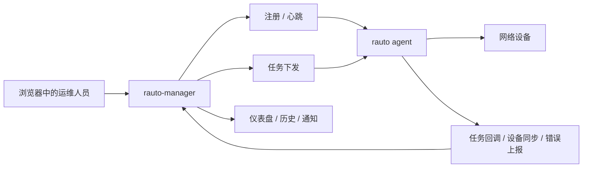

# Rauto Manager - 面向 `rauto` 的多 Agent 控制平面


[English Documentation](README.md)

`rauto-manager` 是一个面向 `rauto` Agent 集群的自托管控制平面。它补上了中心化 Web 管理界面，用来统一处理 Agent 注册、设备清单、任务下发、执行历史、通知告警和管理员登录。

> 当前版本已经具备管理员初始化与登录、PostgreSQL 持久化、Agent 心跳与离线处理、设备同步、任务回调、SSE 实时通知、运行时指标展示，以及中英文界面能力。

## `rauto` 与 `rauto-manager` 的分工

| 项目 | 角色 | 适用场景 |
| --- | --- | --- |
| `rauto` | 执行引擎和本地操作工具 | 在单台工作站或单个 Agent 上执行命令、模板、工作流和本地 Web 控制台操作 |
| `rauto-manager` | 中心化控制平面 | 管理多 Agent、统一设备清单、集中下发任务、查看执行过程与历史 |

## 功能特性

- 统一 Agent 生命周期管理：注册、心跳、离线通知、运行时指标和 Agent 侧错误上报。
- 聚合设备清单：支持从 UI 添加设备、从 Agent 全量同步设备，以及持续更新可达状态。
- 多种任务下发模型：支持 `exec`、`template`、`tx_block`、`tx_workflow`、`orchestrate`。
- 面向操作场景的代理能力：可从 Manager 侧透传 Agent 的连接列表、模板列表和设备配置模板。
- 更安全的设备接入流程：在保存设备前先通过 Agent 测试连接。
- 运维可视化：内置仪表盘、通知中心、最近活动、执行历史，以及基于 SSE 的实时更新。
- 内置管理员引导：首次启动通过 `/setup` 创建管理员，使用 JWT Cookie 做登录态管理，并支持中英文界面。

## 功能演示

### 1. 仪表盘

首页优先展示运维视角最关心的信息：在线 Agent、设备可达性、当天任务结果、最近通知，以及控制平面的健康度。

### 2. Agent 注册

通过注册弹窗直接复制可执行的 `rauto agent` 启动命令，让新 Agent 接入后立刻开始心跳上报和运行时指标汇报。

### 3. 设备接入

先选择在线 Agent，再从该 Agent 动态拉取可用的 device profile，完成连通性测试后，把设备同时写入 Agent 连接库和 Manager 设备清单。

### 4. 任务下发

基于已保存连接，从一个页面里完成 Agent 选择、连接选择和下发类型切换，支持 `exec`、`template`、`tx_block`、`tx_workflow`、`orchestrate` 五种模式。

### 5. 历史与通知

把任务回调、执行结果、设备同步、Agent 异常上报收拢到一个入口，不再需要去多台机器上分别追日志。

## 演示流程



## 截图展示

请将项目截图放到 `docs/screenshots/` 目录，并使用下面这些文件名，GitHub 仓库首页会直接渲染出来。

### 仪表盘总览


### Agent 注册


### 设备接入


### 任务下发


### 任务结果


## 技术栈

- Next.js 16 + React 19 + Tailwind CSS 4
- Prisma 7 + PostgreSQL
- TanStack Query + Zustand
- `next-intl` 中英文本地化

## 快速开始

### 1. 安装依赖

```bash
npm install
```

### 2. 配置环境变量

```bash
cp .env.example .env
```

必填项：

- `DATABASE_URL`：PostgreSQL 连接串。
- `JWT_SECRET`：管理员登录使用的 JWT 签名密钥。
- `AGENT_API_KEY`：Manager 与 `rauto agent` 之间共享的认证密钥。

建议补充：

- `NEXT_PUBLIC_API_URL`：默认是 `http://localhost:3000/api`。
- `NEXT_PUBLIC_AGENT_API_KEY`：如果设置，前端弹窗里可直接生成带 token 的 Agent 注册命令。
- `AGENT_TIMEOUT`：Manager 侧判定 Agent 失活的超时时间。
- `AGENT_HEARTBEAT_INTERVAL`：Manager 侧展示和配置使用的心跳间隔提示值。

### 3. 执行数据库迁移

```bash
npx prisma migrate deploy
```

如果你是在本地开发并且需要迭代 schema，也可以使用 `npx prisma migrate dev`。

### 4. 启动应用

```bash
npm run dev
```

访问 [http://localhost:3000](http://localhost:3000)。首次启动时，`/login` 会自动跳转到 `/setup`，用于创建第一个管理员账号。

## 接入 `rauto` Agent

使用 `rauto` 项目中的托管 Agent 模式启动。`--agent-token` 必须与 Manager 侧的 `AGENT_API_KEY` 保持一致。

```bash
rauto agent \
  --bind 0.0.0.0 \
  --port 8123 \
  --manager-url http://<manager-host>:3000 \
  --agent-name edge-sh-01 \
  --agent-token <same-agent-api-key>
```

接入成功后，Manager 可以接收：

- 注册与心跳更新
- 离线通知
- 设备清单全量同步
- 设备可达性增量更新
- 任务执行回调
- Agent 异步错误上报

## 下发类型

| 类型 | 说明 |
| --- | --- |
| `exec` | 基于已保存连接下发单条命令。 |
| `template` | 传入变量执行命名模板。 |
| `tx_block` | 执行事务式命令块。 |
| `tx_workflow` | 执行由 Agent 处理的工作流负载。 |
| `orchestrate` | 提交多步骤编排计划。 |

## Agent 兼容性

如果你希望完整使用当前 UI 工作流，建议接入较新的 `rauto agent`，并确保其提供以下接口：

- `GET /api/connections`
- `PUT /api/connections/{name}`
- `POST /api/connection/test`
- `GET /api/templates`
- `GET /api/device-profiles/all`
- `POST /api/devices/probe`

`rauto-manager` 已经通过这些接口实现了连接选择、设备模板发现、模板选择、连接测试和设备同步等页面能力。

## 项目结构

```text
rauto-manager/
├── app/                 # 页面与 API Routes
├── components/          # 仪表盘、弹窗、任务表单、通用 UI
├── lib/                 # 认证、Prisma、下发逻辑、状态管理、工具函数
├── messages/            # en.json / zh.json
├── prisma/              # schema 与 migrations
└── README.md            # 英文文档
```

## 相关项目

- [rauto](https://github.com/demohiiiii/rauto)：Rust 编写的网络自动化 CLI、Web 控制台与托管 Agent 运行时。
- [rneter](https://github.com/demohiiiii/rneter)：`rauto` 所依赖的 SSH 连接与设备交互库。

## 许可证

GNU Affero General Public License v3.0（`AGPL-3.0-only`）。

如果你修改了这个项目并以网络服务形式对外提供，你需要按同一许可证公开对应源码。
