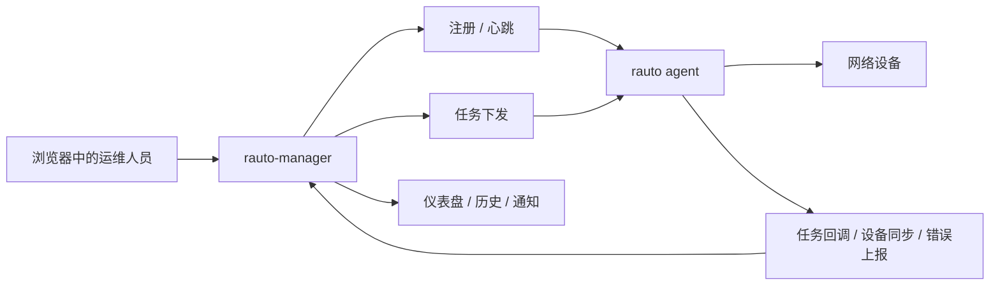

# Rauto Manager - 面向 `rauto` 的多 Agent 控制平面


[English Documentation](README.md)

`rauto-manager` 是一个面向 `rauto` Agent 集群的自托管控制平面。它把 Agent 接入、设备清单、任务下发、工作流/编排设计、执行过程跟踪、通知告警和管理员访问统一收拢到一个 Web 界面里。

- 通过一个控制平面统一管理 HTTP 和 gRPC 两种接入方式的 Agent。
- 普通任务弹窗适合 `exec`、`template`、`tx_block`，可视化设计器适合 `tx_workflow` 和 `orchestrate`。
- 通过实时事件、结构化执行历史和通知中心统一追踪任务执行过程，而不需要逐台 Agent 排查。

## 部署

[](https://vercel.com/new/clone?repository-url=https://github.com/demohiiiii/rauto-manager&project-name=rauto-manager&repository-name=rauto-manager&env=JWT_SECRET,AGENT_API_KEY&envLink=https://github.com/demohiiiii/rauto-manager/blob/main/.env.example&products=%5B%7B%22type%22%3A%22integration%22%2C%22integrationSlug%22%3A%22neon%22%2C%22productSlug%22%3A%22neon%22%2C%22protocol%22%3A%22storage%22%7D%5D)

这个部署入口会在 Vercel 创建项目，并通过 Neon integration 一起创建和绑定 Neon Postgres 数据库。

Neon 配置需要确认：

- 在 Vercel 创建项目的向导里安装或选择 `Neon` integration。
- 如果是在部署向导里新建 Neon 数据库，`DATABASE_URL` 会由集成自动注入，不需要手填。
- 如果你是绑定已有的 Neon 数据库，需要把 `DATABASE_URL` 设为对应数据库的 Neon Postgres 连接串。
- 如果 Neon 另外提供了用于迁移的直连串，建议把它配置到 `DIRECT_DATABASE_URL`，供 Prisma 迁移使用。
- 必须把 Prisma migration 文件提交到 `prisma/migrations/`，这样 `prisma migrate deploy` 才有可执行内容。
- Production 和 Preview 应使用不同的 Neon 数据库或 branch，不要共用同一个库。
- 在 Vercel 表单里仍然需要手动填写 `JWT_SECRET` 和 `AGENT_API_KEY`。

## `rauto` 与 `rauto-manager` 的分工

| 项目 | 角色 | 适用场景 |
| --- | --- | --- |
| `rauto` | 执行引擎和本地操作工具 | 在单台工作站或单个 Agent 上执行命令、模板、工作流和本地 Web 控制台操作 |
| `rauto-manager` | 中心化控制平面 | 管理多 Agent、统一设备清单、集中下发任务、查看执行过程与历史 |

## 功能特性

- 统一 Agent 生命周期管理：支持 HTTP 或 gRPC 上报，覆盖注册、心跳、离线通知、运行时指标、健康检查和 Agent 侧错误上报。
- 聚合设备清单：支持从 UI 添加设备、从 Agent 全量同步设备，以及持续更新可达状态。
- 两种任务入口：普通任务弹窗负责 `exec`、`template`、`tx_block`，可视化设计器负责 `tx_workflow` 和 `orchestrate`。
- 面向操作场景的 Agent 代理能力：支持连接列表/保存、连接测试、模板列表、设备画像和设备同步，并会根据 Agent 接入方式自动选择 HTTP 或 gRPC。
- 更强的执行可视化：支持任务事件、进度更新、结构化结果展示，以及事务块/工作流/编排任务的历史回显。
- 内置文档中心：可从后台直接跳转到 `rauto-manager`、`rauto`、`rneter` 三个相关项目。
- 内置管理员引导：首次启动通过 `/setup` 创建管理员，使用 JWT Cookie 做登录态管理，并支持中英文界面。

## 功能演示

### 1. 仪表盘

首页优先展示运维视角最关心的信息：在线 Agent、设备可达性、当天任务结果、最近通知，以及控制平面的健康度。

### 2. Agent 注册

通过注册弹窗直接复制可执行的 `rauto agent` 启动命令，让新 Agent 接入后立刻开始心跳上报和运行时指标汇报。

### 3. 设备接入

先选择在线 Agent，再从该 Agent 动态拉取可用的 device profile，完成连通性测试后，把设备同时写入 Agent 连接库和 Manager 设备清单。

### 4. 任务下发

普通任务入口适合日常操作：选择在线 Agent、复用已保存连接，完成 `exec`、`template`、`tx_block` 等任务下发。

### 5. 工作流 / 编排设计器

可视化设计器适合 `tx_workflow` 和 `orchestrate`，通过画布组织节点和阶段，而不是手写原始 JSON。

### 6. 历史与通知

把任务回调、执行结果、实时执行事件、设备同步、Agent 异常上报收拢到一个入口，不再需要去多台机器上分别追日志。

## 演示流程



## 截图展示

下面这些截图展示的是当前 `rauto-manager` 的主要界面和日常操作流程。

### 仪表盘总览

集中查看在线 Agent、设备可达性、当天任务结果和最近通知。


### Agent 注册

直接复制可执行的 `rauto agent` 启动命令，快速完成接入和认证配置。


### 设备接入

选择 Agent、测试连接，并通过 Agent 通道把设备写入 Manager 设备清单。


### 任务下发

日常任务可直接从主任务页下发；事务工作流和多设备编排则通过可视化的 `工作流 / 编排` 设计器完成。


### 任务结果

把回调、结构化执行结果和执行历史集中在一个地方查看，不再需要分别去多台机器上追日志。


## 技术栈

- Next.js 16 + React 19 + Tailwind CSS 4
- Prisma 7 + PostgreSQL
- TanStack Query + Zustand
- `next-intl` 中英文本地化

## 快速开始

### 1. 安装依赖

```bash
npm install
```

### 2. 配置环境变量

```bash
cp .env.example .env
```

必填项：

- `DATABASE_URL`：PostgreSQL 连接串。
- `JWT_SECRET`：管理员登录使用的 JWT 签名密钥。
- `AGENT_API_KEY`：Manager 与 `rauto agent` 之间共享的认证密钥。

建议补充：

- `NEXT_PUBLIC_AGENT_API_KEY`：如果设置，前端弹窗里可直接生成带 token 的 Agent 注册命令。
- `NEXT_PUBLIC_MANAGER_URL`：如果设置，前端会用这个公开地址生成 `rauto agent` 启动命令。
- `AGENT_TIMEOUT`：Manager 侧判定 Agent 失活的超时时间。
- `AGENT_HEARTBEAT_INTERVAL`：Manager 侧展示和配置使用的心跳间隔提示值。
- `MANAGER_GRPC_ENABLED`：如果需要启用 Manager gRPC 上报服务，在自托管 Node 环境里设为 `true`。
- `MANAGER_GRPC_HOST` / `MANAGER_GRPC_PORT`：Manager gRPC 服务监听地址和端口，默认端口是 `50051`。
- `MANAGER_GRPC_MAX_MESSAGE_BYTES`：任务事件和回调使用的 gRPC 最大消息大小，默认 `16777216`（16 MB）。

### 3. 执行数据库迁移

```bash
npx prisma migrate deploy
```

如果你是在本地开发并且需要迭代 schema，也可以使用 `npx prisma migrate dev`。

### 4. 启动应用

```bash
npm run dev
```

访问 [http://localhost:3000](http://localhost:3000)。首次启动时，`/login` 会自动跳转到 `/setup`，用于创建第一个管理员账号。

如果你计划接入 gRPC Agent，请使用自托管 Node 环境部署 Manager，并设置 `MANAGER_GRPC_ENABLED=true`。当前内置的 gRPC 服务不会在 Vercel 上启动。

## 接入 `rauto` Agent

使用 `rauto` 项目中的托管 Agent 模式启动。`--agent-token` 必须与 Manager 侧的 `AGENT_API_KEY` 保持一致。

### HTTP 上报模式

```bash
rauto agent \
  --bind 0.0.0.0 \
  --port 8123 \
  --manager-url http://<manager-host>:3000 \
  --report-mode http \
  --agent-name edge-sh-01 \
  --agent-token <same-agent-api-key>
```

### gRPC 上报模式

如果使用 gRPC，请把 `--manager-url` 指向 Manager 的 gRPC 监听地址，例如 `http://<manager-host>:50051`。

```bash
rauto agent \
  --bind 0.0.0.0 \
  --port 8123 \
  --manager-url http://<manager-host>:50051 \
  --report-mode grpc \
  --agent-name edge-sh-01 \
  --agent-token <same-agent-api-key>
```

接入成功后，Manager 可以接收：

- 注册与心跳更新
- 离线通知
- 设备清单全量同步
- 设备可达性增量更新
- 任务实时执行事件
- 任务执行回调
- Agent 异步错误上报

对于 gRPC Agent，Manager 侧的健康检查、连接列表/保存、模板列表、设备画像、连接测试、设备同步和任务下发也都会改走 gRPC，而不是再直连 Agent HTTP 接口。

## 下发类型

| 类型 | 说明 |
| --- | --- |
| `exec` | 基于已保存连接下发单条命令。 |
| `template` | 传入变量执行命名模板。 |
| `tx_block` | 执行事务式命令块。 |
| `tx_workflow` | 执行由 Agent 处理的工作流负载。 |
| `orchestrate` | 提交多步骤编排计划。 |

在当前 UI 中：

- 普通任务弹窗负责 `exec`、`template`、`tx_block`
- `工作流 / 编排` 设计器负责 `tx_workflow`、`orchestrate`

## Agent 兼容性

如果你希望完整使用当前 UI 工作流，建议接入较新的 `rauto agent`。

在 HTTP 模式下，Agent 需要提供这些接口：

- `GET /api/connections`
- `PUT /api/connections/{name}`
- `POST /api/connection/test`
- `GET /api/templates`
- `GET /api/device-profiles/all`
- `POST /api/devices/probe`

在 gRPC 模式下，Agent 需要实现 `AgentTaskService` / `AgentReportingService` 中对应的 RPC，至少包括：

- 任务下发
- 任务事件上报
- 任务回调上报
- 连接列表 / 保存
- 连接测试
- 模板列表
- 设备画像列表
- 设备探测 / 同步

`rauto-manager` 会根据 Agent 当前保存的接入方式，自动选择 HTTP 或 gRPC。

## 项目结构

```text
rauto-manager/
├── app/                 # 页面与 API Routes
├── components/          # 仪表盘、弹窗、任务表单、通用 UI
├── lib/                 # 认证、Prisma、下发逻辑、状态管理、工具函数
├── messages/            # en.json / zh.json
├── prisma/              # schema 与 migrations
└── README.md            # 英文文档
```

## 相关项目

- [rauto](https://github.com/demohiiiii/rauto)：Rust 编写的网络自动化 CLI、Web 控制台与托管 Agent 运行时。
- [rneter](https://github.com/demohiiiii/rneter)：`rauto` 所依赖的 SSH 连接与设备交互库。

## 许可证

GNU Affero General Public License v3.0（`AGPL-3.0-only`）。

如果你修改了这个项目并以网络服务形式对外提供，你需要按同一许可证公开对应源码。
